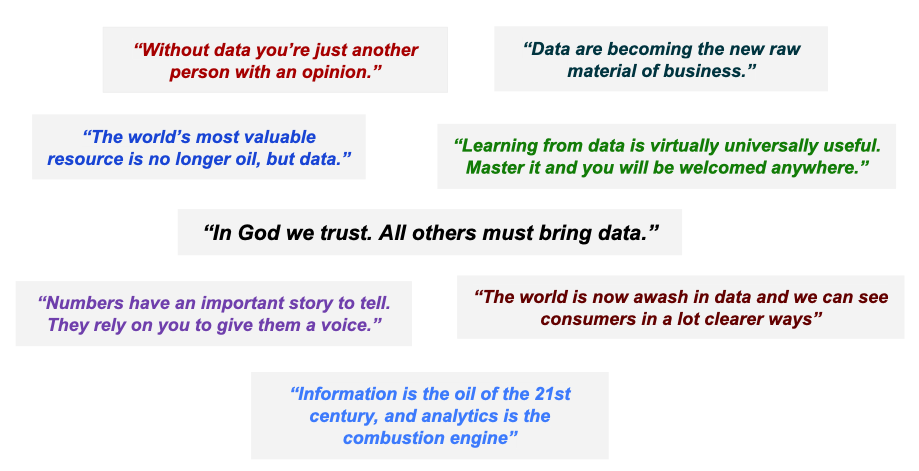
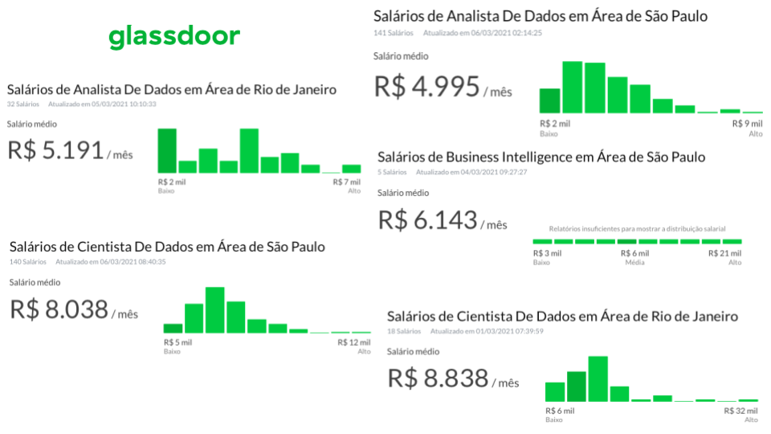
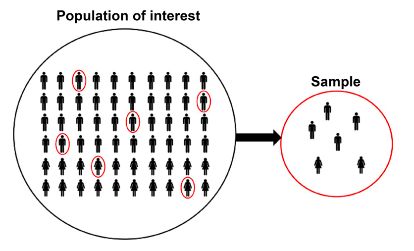

```{r setup, include=FALSE}
knitr::opts_chunk$set(echo = FALSE)
```


# Porque estudar esta matéria?

## Porque estudar esta matéria?

```{r echo=FALSE, out.width = '100%'}

```

## Porque estudar esta matéria?


```{r echo= FALSE, out.width = '100%'}

```

# Estatística e Aplicações

## Estatística e Aplicações

\begin{block}{O que é Estatística?}
É a ciência de coletar, analisar, modelar e interpretar dados. 
\end{block}

Nesta matéria aprenderemos:

>- Como fazer uma análise exploratória de dados (EDA)
>- Como fazer testes de hipóteses
>- Como coletar dados para posteriormente serem analisados
>- Como interpretar corretamente os resultados das nossas análises estatísticas.


\pause


#### Onde vou aplicar estatística na vida real?

>- Estatística tem campo de atuação em uma infinidade de áreas.
>- \color{red} Dados são a nova matéria prima dos negócios \color{black}

----


## Estatística e Aplicações

>- **Auditorias:** Procedimentos de amostragem são utilizados para selecionar aleatoriamente as empresas onde serão feitas auditorias.
>- **Economia e Finanças:** mensuração do risco de mercado (volatilidade, Valor em Risco, Expected Shortfall), alocação de carteiras, identificar se alguem será ou não um bom pagador (risco de crédito), previsões macroeconômicas.
>- **Marketing:** Segmentação de clientes (CRM), *Pricing*, testes A/B, quais clientes têm mais probabilidade de comprar um determinado produto ou serviço, atributos mais valorizados no momento de escolher um produto, etc.
>- Controle de qualidade, reconhecimento de padrões, textmining, criação indicadores de clima laboral, People Analytics, ...


## Estatística e Aplicações

#### Porque usamos estatística?

- Resumir a informação contida nos dados
- Avaliar/Descobrir relações existentes nos dados
- Ter *insights* baseados nos dados que nos dem alguma vantagem competitiva.


# Conceitos Básicos


## Definições


>- **Dados:** são a matéria-prima de qualquer análise estatística, são obtidos da medição de determinadas características das unidades de análise.
>- **Elementos:** ou unidade de análise. São as entidades (pessoa, escolas, empresas, países, etc.) a respeito das quais se coletam dados.
>- **Variável:** Característica de interesse dos elementos.
>- **Observação:** Conjunto de medidas obtidas correspondentes a determinado elemento.

\pause

\begin{center}
\color{blue} 
Uma \textbf{observação} contém \textbf{dados} referentes a várias características (\textit{i.e,} \textbf{variáveis})  que foram medidas dos \textbf{elementos}. 
\color{black}
\end{center}

## Definições

```{r}
knitr::kable(head(mtcars[c(1,3,5), c(1,2,4,9)]), 
             caption = 'Exemplo de um conjunto de dados.', 
             col.names = c('Milhas/galão', 'Cilindros', 'Potencia', 'Cambio'), 
             booktabs = T) 
```

Identifique: observação, variáveis, elementos e dados.


## De onde vêm os dados?


Existem diversas fontes de dados, mas elas podem ser classificadas em dois tipos.

\begin{itemize}
\item \textbf{Fontes de dados internas:} dados gerados pela propria empresa/organização.
\item \textbf{Fontes de dados externas:} dados vindos de fora da
empresa/organização. Por sua vez, dados externos podem ser
classificados em: \begin{itemize}
\item fontes primárias: quando são criados/coledados e publicados pela organização externa (dados do IBGE, Bureaus)
\item fontes secundárias: quando os dados publicados pela instituição, vem de fato de outra (dados publicados em um journal, mas que são indicadores da FGV)
\end{itemize}
\end{itemize}


\begin{center}
\color{red}
Fontes primárias são preferidas, pois temos menor chance de erro.
\color{black}
\end{center}


## Definições


#### Tipos de variável

- Categórica ou Qualitativa
- Numérica ou Quantitativa \begin{itemize}
\item Discretas: se o conjunto de valores que pode assumir é finito ou enumerável (se podemos contá-los)
\item Contínuas: se pode assumir qualquer valor em um intervalo.
\end{itemize}


## Escalas de Medida


- **Escala Nominal:** os valores são apenas um rótulo (unicamente para diferenciá-los). \begin{itemize}
\item Sexo
\item Religião
\item Raça
\item Nacionalidade
\end{itemize}


\pause 


- **Escala Ordinal:** existe uma ordem, mas comparações de diferença e proporção não fazem sentido \begin{itemize}
\item Grau de instrução
\item Nível socioeconômico
\item Qualidade de um produto (escalas tipo *Liker*)
\end{itemize}


\begin{center}
\color{red} Variáveis categóricas estão em escala nominal ou ordinal \color{black}
\end{center}


## Escalas de Medida


- **Escala Intervalar:** comparações de diferença fazem sentido, mas não de proporção. O zero **não** indica ausência da característica. \begin{itemize}
\item Graus Fahrenheit
\item Pontuações em um teste psicológico
\end{itemize}

\pause


- **Escala de Proporção:** Comparações de diferença e proporção fazem sentido. O zero indica que não existe nada para a variável.
\begin{itemize}
\item Peso
\item Altura
\item Distância
\item Preço
\end{itemize}


\begin{center}
\color{red} Variáveis numéricas estão em escala intervalar ou de proporção \color{black}
\end{center}


## Escalas de Medida

Conhecer o tipo de variável e sua escala de medida é importante por vários motivos:

- Nos ajudará a interpretar corretamente os dados
- Fazer análises apropriadas dependendo do tipo de variáveis e escala de medição. (exemplo: se tivermos a variável cor de olhos onde 0 significa cor preto, 1 cor marrom, 2 cor verde e 3 cor azul; não faz sentido nenhum calcular a média desses valores, ou faz?)
- Veremos na próxima aula que existem gráficos para cada tipo de variável e que o tratamento que damos aos dados muda dependendo do seu tipo/escala.


## Estrutura dos Dados


#### Corte transversal

Os dados são coletados no mesmo intervalo de tempo.  Podemos pensar neles como observar uma foto.

\pause

#### Séries temporais

Dados coletados de forma cronológica (a ordem como são coletados é importante)

\pause

#### Outras estruturas

- Corte transversal agrupados
- Dados de painel (longitudinais)


# Estatística Descritiva vs. Estatística Inferencial.


## Estatística Descritiva vs. Estatística Inferencial.

#### Estatística Descritiva

- Utilizada para descrever os dados \begin{itemize}
\item Medidas de tendência central
\item Medidas de variabilidade
\item Tabelas de frequência
\item Gráficos
\end{itemize}

\pause


#### Estatística Inferencial

- Utiliza dados de uma **amostra** para inferir conclusões para a **população** \begin{itemize}
\item Estimativas pontuais
\item Intervalos de Confiança
\item Testes de Hipóteses
\end{itemize}

## Estatística Descritiva vs. Estatística Inferencial.

\begin{center}
```{r echo= FALSE, out.width = '80%'}

```
\end{center}

## Estatística Descritiva vs. Estatística Inferencial.


\begin{center}
```{r echo= FALSE, out.width = '80%'}

```
\end{center}


## Estatística Descritiva vs. Estatística Inferencial.


- **População** é o conjunto de todos os *elementos*^[Usamos o termo **elementos**, pois uma população não é necessáriamente formada por indivíduos.] que são objeto de estudo (elementos dos quais desejamos obter informação)
- Uma **amostra** é um subconjunto da população. 
- Utilizando os dados da **amostra** vamos **inferir** determinadas caracteristicas da **população**.


## Exemplo

Queremos saber a opinião dos moradores do RJ sobre as medidas adotadas para conter o avanço da COVID-19, para o estudo são selecionados 5000 moradores do RJ e se lhes pergunta quão satisfeitos/insatisfeitos estão com as medidas adotadas para conter o avanço da COVID-19 na cidade (se está totalmente insatisfeito, insatisfeito, nem satisfeito/nem insatisfeito, satisfeito, muito satisfeito). Além disso, são também registrados o sexo, idade, e bairro dos moradores selecionados.


- Identifique: população, amostra, variáveis, elementos, etc.


## Estatística no século XXI

\begin{center}
```{r echo= FALSE, out.width = '70%', fig.cap= 'Softwares livres'}

```
\end{center}

- Tudo é feito no computador
- Excel é sempre uma opção razoável
- Existem vários *softwares* livres, nós utilizaremos *R*


### Porque não usar apenas Excel?

\begin{center}
\color{red} 
A tendência é utilizar software livre para analisar dados.
\color{black}
\end{center}


## Leituras recomendadas


- Anderson, D. R; Sweeney, D. J.; e Williams, T. A. (2008). *Estatística Aplicada à Administração e Economia*. 2ed. Cengage Learning. **Cap 1**
- Freund, J. E.; Perles, B. M. (2014). *Modern elementary statistics*. 12ed.  Pearson College Division. **Chapter 1**


## Filmes/Séries recomendados

\begin{center}
```{r echo= FALSE, out.width = '100%'}

```
\end{center}


