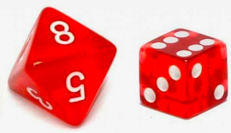
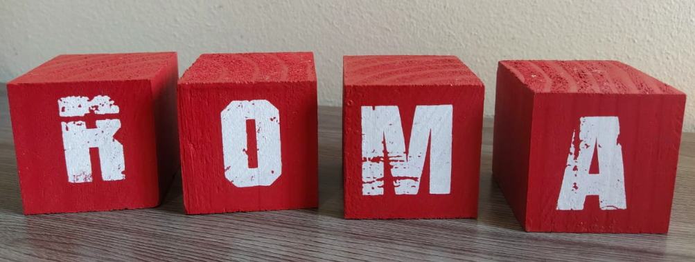

```{r setup, include=FALSE}
knitr::opts_chunk$set(echo = FALSE)
```


# Introdução

## Introdução

Um sistema de comunicação é formado por $n = 5$ antenas aparentemente idênticas que devem ser alinhadas em sequência. O sistema será funcional (i.e. capaz de receber qualquer sinal) se duas antenas consecutivas não apresentam defeito (1: antena sem defeito e 0: antena com defeito). Se $m=2$ das $n$ antenas apresentam defeito:

\pause
>- Quantas configurações possíveis existem para o sistema?
>- Quantas dessas configurações são funcionais?


## Motivação
```{r, warning=FALSE, echo=FALSE, message=FALSE}
library(combinat)
x = c(0,0,1,1,1)
A <- matrix(unlist(unique(permn(x))), ncol = length(x), byrow = TRUE)
row.names(A) <- c("Config.1", "Config.2", "Config.3", "Config.4", "Config.5", "Config.6", "Config.7", "Config.8", "Config.9", "Config.10")
knitr::kable(A, col.names = c("Ant.1", "Ant.2", "Ant.3", "Ant.4", "Ant.5"), align = "ccccc")
```

>- Quantas configurações possíveis existem para o sistema?
>- Quantas dessas configurações são funcionais?

## Motivação
E se....

>- $n = 10$ e $m = 3$
>- $n = 30$ e $m = 9$
>- $n = 124$ e $m = 50$

\pause 

\begin{center}
\color{violet}
Possuir um método eficaz para contar o número de formas pelas quais as coisas podem acontecer é bastante útil.
\color{black}
\end{center}


\pause 

\begin{center}
\color{red}
A teoria matemática de contagem é formalmente conhecida como \textbf{análise combinatória}.
\color{black}
\end{center}


\pause 

\begin{center}
\color{blue}
Sermos capazes de identificar e contar possíveis resultados é uma etapa importante e necessária na atribuição de probabilidades.
\color{black}
\end{center}


# Princípio básico de contagem


## Princípio básico de contagem

```{r echo=FALSE, message=FALSE, warning=FALSE,fig.width=5.5, fig.height=2.5}
library(ggplot2)
dados = data.frame(x = c(0,5,10), y = c(0,0,0), nomes = c("A", "B", "C"))
ggplot(dados, aes(x,y)) + geom_point(colour="green4", size = 4) + geom_text(aes(label=nomes),hjust=0, vjust= 2, size=8) + xlim(c(0,10)) + ylim(c(-1,1)) + ylab(" ") + xlab(" ") 
```


## Princípio básico de contagem

### O princípio básico de contagem

Suponha a realização de dois experimentos ($E_1$ e $E_2$). Se o $E_1$ pode gerar qualquer um de $n_1$ resultados possíveis e se, para cada um dos resultados de $E_1$ (ou seja, independentemente do resultado obtido em $E_1$), existem $n_2$ resultados possíveis do $E_2$, então os dois experimentos possuem conjuntamente $n_1 \times n_2$ resultados possíveis


## Princípio básico de contagem

### Exemplo
Suponha que se lançam dois dados (um convencional e outro com 8 faces) e que observamos o número da face superior. Qual o número de resultados possíveis que podem ser obtidos?

::: columns

:::: column
{ width=90% }
::::

:::: column

\pause

>- 8: do dado de 8 faces
>- 6: do dado de 6 faces
>- Pelo princípio básico de contagem, $$8 \times 6 = 48$$


::::

:::


## Princípio básico de contagem

### Generalização do princípio básico de contagem
Sejam $r$ experimentos ($E_1$, $E_2$, $\cdots$, $E_r$) tais que $E_1$ pode levar a qualquer um de $n_1$ resultados, $E_2$ pode levar a qualquer um de $n_2$ resultados (independente do resultado obtido no $E_1$), ....  $E_r$ pode levar a qualquer um de $n_r$ resultados (independente do resultados obtido no $E_1, \cdots, E_{r-1}$). Então, para os $r$ experimentos teremos um total de $n_1 \times n_2 \times \cdots \times n_r$ resultados possíveis. 

\pause 
### Exemplo


::: columns

:::: column
{ width=90%}
::::

:::: column

\pause

>- 6: do primeiro dado
>- 6: do segundo dado
>- 6: do terceiro dado
>- 6: do quarto dado
>- 6: do quinto dado
>- $6 \times 6 \times 6 \times 6 \times 6 = 6^5 = 7776$
::::

:::


## Princípio básico de contagem

### Outros exemplos
Sabendo que cada placa de carro é formada por 7 caracteres (sendo os 3 primeiros espaços ocupados por letras e os 4 restantes por números). Quantas placas de carro distintas podem existir?

\pause


::: columns

:::: column
{ width=100%}
::::

:::: column

\pause

>- Primeira posição: 26 opções
>- Segunda posição: 26 opções
>- Terceira posição: 26 opções
>- Quarta posição: 10 opções
>- Quinta posição: 10 opções
>- Sexta posição: 10 opções
>- Sétima posição: 10 opções
>- $$26^3 \times 10^4  = 6760000$$
::::

:::


## Princípio básico de contagem

### Outros exemplos
Um experimento consiste em lançarmos uma moeda 5 vezes seguidas e observarmos em cada lançamento se foi obtido cara ou coroa. Qual é o número de resultados possíveis deste experimento?


\pause

\begin{center}

```{r echo=FALSE, out.width = '20%'}

```

\end{center}


\pause

>- ____$, \quad$  ____$, \quad$  ____$, \quad$  ____$, \quad$  ____ 
>- $2 \times  2 \times 2 \times 2 \times 2 = 2^5 = 32$


## Princípio básico de contagem

#### Para praticar:

- Quantas placas de carro seriam possíveis se a repetição entre letras é proibida mas entre números é permitida?


# Arranjos, Permutações e Combinações


## Arranjos


#### Arranjos com repetição
Seja $M$ um conjunto com $n$ elementos ($a_1, \cdots, a_n$). Chamamos arranjo com repetição dos $n$ elementos tomados $r$ a  $r$, a toda r-upla **ordenada** formada com elementos de M (**não necessariamente distintos**).

\pause 

$$A_n^r = n^r$$

\pause 

#### Arranjos (sem repetição)
Seja $M$ um conjunto com $n$ elementos ($a_1, \cdots, a_n$). Chamamos arranjo dos $n$ elementos tomados $r$ a $r$, a toda r-upla **ordenada** formada com elementos **distintos** de $M$.

\pause 

$$A_n^r = n \times (n-1) \times \cdots (n-r+1)$$

## Permutações

Suponha que temos 3 livros diferentes: Cálculo (C), Estatística (E) e Investimentos (I). Os livros podem ser ordenados da seguinte forma

\pause 


::: columns

:::: column

```{r echo=FALSE, out.width = '90%'}
knitr::include_graphics("imagens/livros.jpeg")
```

::::

:::: column

```{r echo=FALSE, message=FALSE, warning=FALSE}
library(combinat)
x = c("C", "E", "I")
A <- matrix(unlist(unique(permn(x))), ncol = length(x), byrow = TRUE)
row.names(A) <- c("Config.1", "Config.2", "Config.3", "Config.4", "Config.5", "Config.6")
knitr::kable(A, col.names = c("Livro 1", "Livro 2", "Livro 3"), align = "ccc")
```


::::

:::


## Permutações

E se tivermos 4 livros: Cálculo (C), Estatística (E), Investimentos (I) e Gestão de Processos (G)?

\pause 


```{r echo=FALSE, message=FALSE, warning=FALSE}
library(combinat)
x = c("C", "E", "I", "G")
A <- matrix(unlist(unique(permn(x))), ncol = length(x), byrow = TRUE)
row.names(A) <- c("Config.1", "Config.2", "Config.3", "Config.4", "Config.5", "Config.6", "Config.7", "Config.8", "Config.9", "Config.10", "Config.11", "Config.12","Config.13", "Config.14", "Config.15", "Config.16", "Config.17", "Config.18", "Config.19", "Config.20", "Config.21", "Config.22", "Config.23", "Config.24")
knitr::kable(A[1:11,], col.names = c("Livro 1", "Livro 2", "Livro 3", "Livro 4"), align = "cccc", pad=0)
```


## Permutações


```{r}
knitr::kable(A[12:24,], col.names = c("Livro 1", "Livro 2", "Livro 3", "Livro 4"), align = "cccc", pad=0)
```


## Permutações


\begin{center}
\color{violet}
E se tivermos 5, 6, ....89 livros?
\color{black}
\end{center}


\pause

O número de maneiras de ordenar $n$ objetos distintos é $n!$ ($n$ fatorial) \begin{equation*}
n \times (n-1) \times (n-2) \times \cdots \times 1 = n!,
\end{equation*}

\pause

#### Permutação
Seja $M$ um conjunto com $n$ elementos. Chamamos de permutação (dos $n$ elementos) a todo arranjo (sem reposição) em que $r = n$.


$$P_n = n \times (n-1) \times (n-2) \times \cdots \times 1 = n!$$


## Permutações


#### Exemplo

Em uma disputa por pênaltis entre Botafogo e Fluminense, o técnico do Botafogo escolhe os 5 jogadores mas ainda não tem certeza da ordem na qual os jogadores irão chutar os pênaltis. De quantas formas diferentes essa ordenação pode ser feita?


::: columns

:::: column
{ width=100%}

::::

:::: column

>- De quantas formas podemos ordenar os 5 jogadores do botafogo?
>- $P_5 = 5! = 5 \times 4 \times 3 \times 2 \times 1 = 120$


::::

:::


## Permutações


#### Exemplo

Quantos anagramas podemos formar com a palavra AMOR?

\pause


::: columns

:::: column
{ width=100%}

::::

:::: column

\pause

{ width=100%}

::::

:::

\pause

$$P_4 = 4! =  4 \times 3 \times 2 \times 1 = 24$$


## Permutações

#### Para praticar:

No exemplo dos pênaltis, o técnico do botafogo escolhe 2 jogadores para chutar o primeiro e último pênalti, mas ainda está na dúvida quem chutara o primeiro penâlti e quem o último pênalti. Além disso, ele ainda está na duvida sobre a ordem que os 3 jogadores do meio chutarão os pênalties.

De quantas formas diferentes a ordenação (total) pode ser feita?


## Combinações

Agora estamos interessados em determinar o número de grupos diferentes de $r$ objetos que podem ser formados a partir de um total de $n$ objetos distintos.
\pause 

>- Sejam $n = 5$ objetos distintos (A, B, C, D, E) e queremos selecionar grupos de $r = 3$. 
>- Se a ordem fosse importante teríamos: $5\times 4 \times 3 = 60$ formas diferentes de selecionar os grupos de 3. ($A_5^3$)
>- Mas, neste problema a ordem dos elementos é irrelevante (ABC .... BCA são na verdade um mesmo grupo)
>- Para evitar que, por exemplo o grupo formado por ABC seja contado $3!$ vezes, precisamos remover o efeito da ordem.
>- Então, o número de grupos diferentes de $r=3$ objetos que podem ser formados de um total de $n=5$ objetos distintos é \begin{equation*}
\dfrac{5 \times 4 \times 3}{3 \times 2 \times 1} = 10
\end{equation*}


## Combinações

>- Em geral, $n(n-1)\cdots(n-r+1)$ representa o número de maneiras diferentes que um grupo de $r$ elementos pode ser formado a partir de um total de $n$ elementos distintos quando a ordem importa. 
>- Como cada grupo de $r$ items será contado $r!$ vezes, temos que o número de grupos **diferentes** de $r$ itens que podem ser formados é dado por \begin{equation*}
\dfrac{n (n-1) \cdots (n-r+1)}{r!}  = \dfrac{n!}{r! (n-r)!} = \binom{n}{r}
\end{equation*}

\pause 
- $\binom{n}{r}:$ número de combinações possíveis de $n$ objetos em grupos de $r$ elementos.


## Combinações

#### Combinação
Seja $M$ um conjunto com $n$ elementos ($a_1, \cdots, a_n$). Chamamos de combinação dos $n$ elementos tomados $r$ a $r$, a todo subconjunto de $M$ constituido de $r$ elementos **diferentes**.

\pause

$$C_n^r = \binom{n}{r} = \dfrac{n!}{r!(n-r)!}$$

## Combinações

#### Exemplos

A $P_1$ de MAD211 possui 7 questões das quais o alumo deve escolher apenas 5. De quantas formas poderá escolher as 5 questões?

\pause

::: columns

:::: column
{ width=100%}

::::

:::: column

\pause

>- Temos $n = 7$ questões e precisamos escolher apenas $r = 5$ questões
>- A ordem como eu responder as perguntas importa? (muda minha nota?)
>- Como a ordem não importa, estamos em um problema de _Combinação_

::::

:::

\pause

$$\binom{7}{5} = \dfrac{7!}{5! (7-5)!} = \dfrac{7 \times 6 \times 5!}{5! \times 2!} = \dfrac{7 \times 6}{2} = 21$$


## Combinações

#### Exemplo

Uma sala possui 25 alun`@`s (15 mulheres e 10 homens), de quantas formas podemos selecionar 5 alunos de forma que 3 sejam mulheres e 2 homens?

>- Temos $n = 25$ alun`@`s, dos quais $n_m = 15$ são mulheres e $n_h = 10$ são homens.
>- Queremos selecionar $r = 5$ alun`@`s, dos quais $r_m = 3$ sejam mulheres e $r_h = 2$ sejam homens.
>- Como a ordem em que os alun`@`s são selecionad`@`s não importa, estamos em um problema de _combinação_.


## Combinações

#### Exemplo


::: columns

:::: column

Das $n_m = 15$ mulheres, selecionamos $r_n = 3$.

$$\binom{15}{3} = \dfrac{15!}{3! (15-3)!} = 455$$

::::

:::: column

\pause

Dos $n_h = 10$ homens, selecionamos $r_h = 2$.

$$\binom{10}{2} = \dfrac{10!}{2! (10-2)!} = 45$$

::::

:::

\pause

A forma como selecionamos os homens e as mulheres é independente, então pelo princípio multiplicativo: \pause $$\binom{15}{3} \times \binom{10}{2} = 20475$$


## Combinações

\begin{center}
\color{violet}
Combinação ou Arranjo?
\color{black}
\end{center}

\pause

>- Combinação: ordem não importa
>- Arranjo: ordem importa


\pause


#### Resumo

O número de maneiras de formar grupos de $r$ elementos de um conjunto com $n$ elementos **distintos**, dependendo se o mesmo objeto pode ser escolhido mais de uma vez (amostragem com ou sem reposição) e se a ordem com que os objetos são escolhidos importa ou não, pode ser resumida em:
\pause 

|               | Ordem importa             |   Ordem não importa  |
|---------------|:-------------------------:|:--------------------:|
| Com reposição |  $n^r$                    | $\binom{r+n-1}{r-1}$ |
| Sem reposição | $n (n-1) \cdots (n-r+1)$  |   $\binom{n}{r}$     |


# Coeficientes multinomiais

    
## Coeficientes multinomiais

**Considere o seguinte problema:** 

1. Um conjunto de $n$ elementos **distintos** deve ser dividido em $r$ grupos de tamanhos $n_1$, $n_2$, ..., $n_r$, respectivamente tais que $\displaystyle \sum_{i = 1}^r n_i = n$. De quantas formas possíveis isto pode ser feito?
2. Quantos anagramas podemos formar com a palavra MAMAE?

\color{red} Embora os problema sejam distintos, a solução é dada pela mesma fórmula: \color{black}

\pause 
**Resposta** \begin{equation*}
\dfrac{n!}{n_1! n_2! \cdots n_r!} = \binom{n}{n_1, n_2, \cdots, n_r}
\end{equation*} formas diferentes.


## Coeficientes multinomiais
**Primeiro caso**

>- Para o primeiro grupo temos $\binom{n}{n_1}$ escolhas possíveis
>- Para c/escolha do primeiro grupo temos $\binom{n-n_1}{n_2}$ escolhas possíveis para o segundo grupo.
>- Para c/escolha dos dois primeiros grupos temos $\binom{n-n_1-n_2}{n_3}$ escolhas possíveis para o terceiro grupo
>- ...
>- Para c/escolha dos $r-1$ primeiros grupos temos $\binom{n-n_1-n_2- \cdots - n_{r-1}}{n_r}$ escolhas possíveis para o $r-$ésimo grupo

\pause
Aplicando a versão generalizada do principio básico de contagem \begin{equation*}
\binom{n}{n_1} \binom{n-n_1}{n_2} \cdots \binom{n-n_1-n_2- \cdots - n_{r-1}}{n_r} = \dfrac{n!}{n_1! n_2! \cdots n_r!}
\end{equation*}

## Coeficientes multinomiais
**Segundo caso**

>- Temos $n$ elementos (mas apenas $r$ são distintos. O elemento i, repete-se $n_i$ vezes  e $n_1+n_2+\cdots+n_r=n$)
>- O número de formas de ordenar esses $n$ elementos é $n!$
>- Mas, por exemplo, $M^1A^1M^2A^2E$ e $M^2A^2M^1A^1E$ são idênticos 
>- Precisamos remover o efeito dessas configurações repetidas
>- Para c/conf teremos $n_1!$ formas de ordenar a letra 1, $n_2!$ formas de ordenar a letra 2, ... $n_r!$ formas de ordenar a letra $r$. (i.e $n_1! n_2! \cdots n_r!$ configurações repetidas)
>- $$\dfrac{n!}{n_1! n_2! \cdots n_r!} = \binom{n}{n_1, n_2, \cdots, n_r}$$


\pause

\begin{center}
Este caso é conhecido como permutação com repetição.
\end{center}

## Coeficientes multinomiais

#### Exemplo
Quantos anagramas podemos formar com a palavra MATEMATICA?

\pause

>- MATEMATICA: 10 caracteres ($n = 10$)
>- M: se repete 2 vezes ($n_m = 2$)
>- A: se repete 3 vezes ($n_a = 3$)
>- T: se repte 2 vezes ($n_t = 2$)
>- $n_e = 1$, $n_i = 1$ e $n_c$ = 1

\pause

Então, $$\dfrac{n!}{n_1! n_2! \cdots n_r!} = \dfrac{10!}{2! \times 3! \times 2! \times 1! \times 1! \times 1!} = 151200$$


## Coeficientes multinomiais

#### Exemplo
Uma urna contém 3 bolas verdes e 2 bolas azuis. Elas são extraídas uma a uma (sem reposição). Quantas sequências de cores podemos observar?

\pause

>- Estamos interessados na sequência de cores (ou seja **a ordem importa**)
>- Temos $n = 5$ bolas mas $n_v = 3$ são verdes e $n_a = 2$ sñao azuis.
>- $\color{green} Verde_1, \color{blue} Azul_1, \color{green} Verde_2, Verde_3, \color{blue} Azul_2$ \color{black} e $\color{green} Verde_3, \color{blue} Azul_2, \color{green} Verde_1, Verde_2, \color{blue} Azul_1$ \color{black} são sequências de cores idênticas.
>- Estamos no caso de permutação com repetição, então  $$\dfrac{5!}{3! 2!} = 10$$


## Coeficientes multinomiais

#### Exemplo
Em uma turma de 23 alunos, serão formados 3 grupos (A, B e C) com 8, 8 e 7 alunos, respectivamente. De quantas formas diferentes podem ser formados os grupos?

\pause

>- Estamos no caso de dividir $n = 23$ elementos em $r = 3$ grupos onde o grupo 1 tem $n_1 = 8$ elementos, o grupo 2 $n_2 = 8$ elementos e o grupo 3 $n_3 = 7$ elementos.
>- Então $$\dfrac{23!}{8! 8! 7!} = 3155170590$$


# Soluções de equações inteiras

## Número de soluções de equações inteiras

**Caso 1: ** O melhor alun@ da turma de MAD211 ganha um voucher de 5 coxinhas do Bar do Luizão, que por sua vez possui 8 sabores diferentes de coxinha.  De quantas formas o alun@ pode selecionar as 5 coxinhas?

\pause
>- **Opcão A:** Arranjo (ordem importa)
>- **Opção B:** Combinação (ordem não importa)
>- **Opção C:** Nenhuma das anteriores
\
\
\
\
\
\
\
\
\
\
\
\
\


## Número de soluções de equações inteiras

>- $x_1$: número de coxinhas do sabor 1
>- $x_2$: número de coxinhas do sabor 2
>- $\cdots$
>- $x_8$: número de coxinhas do sabor 8
\pause
\begin{equation}\label{eq1}
x_1+x_2+x_3+x_4+x_5+x_6+x_7+x_8 = 5
\end{equation}

\pause
**Queremos** a solução de (\ref{eq1}) t.q $x_i \geq 0$

\pause
A ordem como pedimos as coxinhas importa? \pause Não


## Número de soluções de equações inteiras

**Caso 2: ** A fabrica de escrivaninhas "Marquesone" dispõe de 3 cores diferentes para pintar 7 escrivaninhas idênticas.  De quantas formas isto pode ser feito?

\pause
- $x_1$: número de escrivaninhas pintadas da cor 1
- $x_2$: número de escrivaninhas pintadas da cor 2
- $x_3$: número de escrivaninhas pintadas da cor 3

\begin{equation}\label{eq2}
x_1+x_2+x_3 = 7
\end{equation}

\pause
**Queremos** a solução de (\ref{eq2}) t.q $x_i \geq 0$

\pause
A ordem importa? \pause Não, as escrivaninhas são idênticas


## Número de soluções de equações inteiras

#### Caso 1:
O melhor alun@ da turma de MAD211 ganha um voucher de 5 coxinhas do Bar do Luizão, que por sua vez possui 8 sabores diferentes de coxinha.  De quantas formas o alun@ pode selecionar as 5 coxinhas? (a ordem não importa)

\pause
**Reinterpretando** De um total de $n = 5$ elementos (não necessariamente $\neq$), queremos formar $r = 8$ grupos de tamanhos $x_1, ..., x_8$ t.q $x_i \geq 0$. 

\pause

#### Caso 2:
A fabrica de escrivaninhas "Marquesone" dispõe de 3 cores diferentes para pintar 7 escrivaninhas idênticas.  De quantas formas isto pode ser feito?

\pause
**Reinterpretando** De um total de $n = 7$ elementos (idênticos, i.e a ordem não importa), queremos formar $r = 3$ grupos de tamanhos $x_1, x_2, x_3$ t.q $x_i \geq 0$.


## Número de soluções de equações inteiras

#### Proposição 1
O número de soluções inteiras da equação $x_1+x_2+\cdots+x_r = n$ com $x_i \geq 0$ é $$\binom{n+r-1}{r-1}$$

\pause
#### Proposição 2
O número de soluções inteiras da equação $x_1+x_2+\cdots+x_r = n$ com $x_i >0$ é $$\binom{n-1}{r-1}$$

## Número de soluções de equações inteiras

#### Exemplo

Você possui 15K (15 mil) reais para aplicar entre 3 investimentos possíveis (cada aplicação deve ser feita em unidades de 1K reais). Se os 15K devem ser investidos, quantas estratégias de investimento você tem?.

\pause

Estamos interessado no problema $$x_1 + x_2 + x_3 = 15$$ com $x_i \geq 0$ (pois não somos obrigados a investir necessáriamente em cada tipo de investimento).

\pause

Temos $n = 15$ e $r = 3$, então $$\binom{n+r-1}{r-1} = \binom{15+3-1}{3-1} = \binom{17}{2} = 136$$


## Voltando ao inicio

Um sistema de comunicação é formado por $n$ antenas aparentemente idênticas que devem ser alinhadas em sequência. O sistema será funcional (i.e. capaz de receber qualquer sinal) se duas antenas consecutivas não apresentam defeito. Se $m$ das $n$ antenas apresentam defeito:

>- $n$ objetos idênticos dos quais $m$ são defeituosos
>- $\underbrace{D \hspace{0.6cm} D \hspace{0.6cm} D \hspace{0.6cm} D \hspace{0.6cm} \cdots \hspace{0.6cm} D}_\text{m-antenas defeituosas}$
>- Colocamos as $n-m$ antenas não defeituosas nas $m+1$ posições $$x_1 \hspace{0.2cm}D\hspace{0.2cm} x_2 \hspace{0.2cm}D \cdots x_m \hspace{0.2cm}D \hspace{0.2cm}x_{m+1}$$
>- Precisamos $$x_1+...+x_{m+1} = n-m$$ t.q $x_1, x_{m+1} \geq 0$ e $x_i >0$ $i = 2, ..., m$

## Voltando ao inicio

>- Fazendo $y_1 = x_1+1$, 
>- $y_{m+1} = x_{m+1}+1$, 
>- $y_i = x_i$ ($i = 2, ..., m$)

\pause
Então $$x_1+...+x_{m+1} = n-m$$ t.q $x_1, x_{m+1} \geq 0$ e $x_i >0$ $i = 2, ..., m$ é equivalente a $$y_1+...+y_{m+1} = n-m+2$$ t.q $y_i>0$

## Voltando ao inicio

#### Lembrando (proposição 2)
O número de soluções inteiras da equação $x_1+x_2+\cdots+x_r = n$ com $x_i >0$ é $$\binom{n-1}{r-1}$$

\pause

Aplicando a fórmula: \begin{center} $\binom{n-m+2-1}{m+1-1} = \binom{n-m+1}{m}$ \end{center}

\pause
No caso particular de  $n = 5$ e $m = 2$, então temos $$\binom{5-2+1}{2} = 6$$ configurações funcionais.


## Leituras recomendadas

- Anderson, D. R; Sweeney, D. J.; e Williams, T. A. (2008). *Estatística Aplicada à Administração e Economia*. 2ed. Cengage Learning. **Cap 4.1**
- Sheldon Ross (2010). *Probabilidade: Um curso moderno com aplicações*. 8ed, Bookman.  **Cap 1.1 -- 1.6**
- Degroot, M. H;  e Schervish, M. J. (2012). *Probability and Statistics*. 4ed, Pearson. **Chapter 1.7--1.9**


