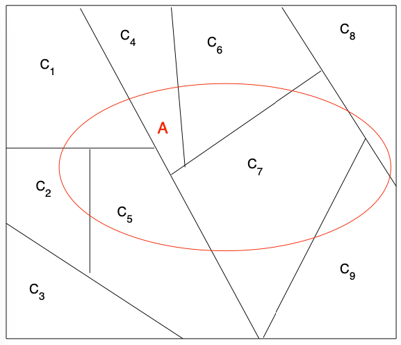

```{r setup, include=FALSE}
knitr::opts_chunk$set(echo = TRUE)
```


# Motivação

## Motivação

Se lançarmos aleatoriamente dois dados, qual é a probabilidade de obtermos um 8? 

\begin{center}

```{r echo=FALSE, out.width = '30%'}

```

\end{center}

\pause

>- $S = \{ (i,j): i, j = 1, \ldots, 6 \}$, $N = 36$
>- Seja o evento $A:$ A soma da face superior em ambos os dados é 8, então $A = \{ (2,6), (3,5), (4,4), (5,3), (6,2) \}$,  $$P(A) = \dfrac{N(A)}{N} = \dfrac{5}{36}$$

## Motivação


Se soubermos que o primeiro dado é um 3, qual a probailidade de obter um 8?

\begin{center}

```{r echo=FALSE, out.width = '30%'}

```

\end{center}

\pause 
>- $S = \{(3,1), (3,2), (3,3), (3,4), (3,5), (3,6) \}$, $N = 6$
>- $B:$ A soma da face superior em ambos os dados é 8, então $B = \{ (3,5) \}$
>- $$P(B) = \dfrac{N(B)}{N} = \dfrac{1}{6}$$

## Motivação

\color{violet}

Frequentemente, a probabilidade de um evento é influenciada pelo fato de um evento relacionado já ter ocorrido ou não.

\color{black}

\pause


Por exemplo, sejam $A$ e $B$ dois eventos tais que:

- $A:$ A soma da face superior em ambos os dados é 8, 
- $B:$ A face do primeiro dado é 3.

\pause
Queremos a probabilidade de $A$ acontecer, dado que $B$ acontece. Denotamos esta probabilidade por, $$P(A|B) \quad \text{(leia-se probabilidade de A dado B)}$$

\pause

\begin{center}
\color{red}
Nosso conhecimento sobre $A$ é atualizado dado nosso conhecimento sobre $B$.
\color{black}
\end{center}


# Probabilidade Condicional: Definição

## Probabilidade Condicional: Definição

#### Probabilidade Condicional
Sejam $A, B \subset S$, com $P(B)>0$. Então  a probabilidade condicional do evento A _dado_ o evento B é dado por $$P(A|B) =  \dfrac{P(A \cap B)}{P(B)},$$ se $P(B) = 0$, $P(A|B) = P(A)$^[Se $P(B) = 0$, alguns livros definem $P(A|B) = 0$]

\pause

**Intuição:** A ocorrencia do evento $B$ modifica o probabilidade de $A$ acontecer (pois teremos em $S$ apenas os casos onde $B$ acontece).


## Probabilidade Condicional é Probabilidade

**Probabilidade Condicional é realmente uma probabilidade:**

\pause

Prova para $P(B) > 0$ (se $P(B) = 0$, a prova é trivial)

\pause

>- $P(A|B) = \dfrac{\overbrace{P(A \cap B)}^{\geq 0}}{\underbrace{P(B)}_{> 0}} \geq 0$
>- $P(S|B) = \dfrac{P(SB)}{P(B)} = \dfrac{P(B)}{P(B)} = 1$ 
>- $P(\bigcup\limits_{i=1}^{\infty}A_i|B) = \frac{P(\bigcup\limits_{i=1}^{\infty}A_i  B)}{P(B)}  = \frac{P(\bigcup\limits_{i=1}^{\infty}(A_i  B))}{P(B)} = \frac{\displaystyle\sum_{i = 1}^{\infty} P(A_i B)}{P(B)} = \displaystyle\sum_{i = 1}^{\infty} P(A_i|B)$


\pause


\begin{center}
\color{red}
Probabilidade condicional satisfaz os 3 axiomas de Kolmogorov.
\color{black}
\end{center}


## Exemplos

**Suponha que, de todos os individuos que compram um celular pela internet:**

- 60\% incluem uma capinha protetora no carrinho de compras, 
- 40\% incluem um fone de ouvido e 
- 30\% incluem ambos (capinha e fone). 

**Se selecionarmos um individuo (que comprou celular) aleatoriamente**

a. Qual é a probabilidade do individuo ter comprado um fone de ouvido se soubermos que comprou uma capinha?
b. Qual é a probabilidade do individuo ter comprado uma capinha se soubermos que comprou um fone de ouvido?

## Exemplos

Temos que: 60\% incluem uma capinha, 40\% incluem um fone e 30\% incluem ambos.

\pause

Sejam os eventos:


- $A:$ comprar fone
- $B:$ comprar capinha

\pause

a. Queremos $P(A|B)$,

\pause

$$P(A|B) = \dfrac{P(A\cap B)}{P(B)} = \dfrac{0.3}{0.6} = 1/2$$
\pause

b. De forma analoga, $P(B|A) = \dfrac{P(B\cap A)}{P(A)} = \dfrac{0.3}{0.4} = 0.75$

## Exemplos

\color{violet}

Uma urna tem 1 carta azul e 4 cartas vermelhas. João extrai duas cartas aleatoriamente (sem reposição). Qual é a probabilidade da segunda carta ser vermelha se, a primeira carta foi vermelha?

\color{black}

\pause

>- Seja $A:$ extrair uma carta vermelha na primeira extração, $P(A) = \dfrac{4}{5}$
>- Seja $B:$ extrair uma carta vermelha na segunda extração
>- De forma intuitiva: $P(B|A) = \dfrac{3}{4}$
>- Usando a definição: $$P(B|A) = \dfrac{P(B \cap A)}{P(A)} = \dfrac{P(A \cap B)}{P(A)} = \frac{\dfrac{4\times 3}{5 \times 4}}{\dfrac{4}{5}} = \dfrac{3}{4}$$


## Propriedades

Probabilidade condicional satisfaz os axiomas de Kolmogorov (i.e. é Probabilidade). Consequentemente, todas as propriedades validas para probabilidade são também validas para Probabilidade Condicional.


>- $0 \leq P(A|B) \leq 1$
>- $P(A^{c}|B) = 1-P(A|B)$
>- $P(A \cup B |C) = P(A|C) + P(B|C) - P(A \cap B | C)$
>- $\ldots$


# Regra da Multiplicação

## Regra da Multiplicação

Muitas vezes estamos interessados em probabilidades do tipo $P(A\cap B)$. Se tivermos $P(A)$ e $P(B|A)$, a probabilidade desejada é facilmente obtida.

\pause

#### Teorema 1: Regra da Multiplicação.

>- (a) Sejam os eventos $A$ e $B$. Então $$P(A \cap B) = P(A) P(B|A)$$
>- (b) Sejam os eventos $A_1, A_2, \ldots, A_n$. Então $$P(A_1 A_2 \ldots A_n) = P(A_1) P(A_2|A_1) P(A_3|A_2A_1) \ldots P(A_n|A_{n-1}\ldots A_1)$$


## Regra da Multiplicação: Prova

**(a)** Decorre da definição. \pause $$P(B|A) = P(B \cap A)/P(A) \Rightarrow P(A \cap B) = P(A) P(B|A)$$

\pause 

**(b)** (Por indução)

\pause

>- Para $2$ eventos é valida (parte a)
>- Supomos que vale para $n$, \pause \begin{center} $P(A_1 A_2 \ldots A_n) = P(A_1) P(A_2|A_1) \ldots P(A_n|A_{n-1}\ldots A_1)$ \end{center} \pause
>- Vamos provar para $n+1$, \pause  \begin{align*}
P(\underbrace{A_1 \ldots A_n}_{\color{red} A \color{black}} \underbrace{A_{n+1}}_{\color{red} B \color{black}}) &= P(\underbrace{A_{n+1}}_{\color{red} B \color{black}}|\underbrace{A_1 \ldots A_n}_{\color{red} A \color{black} }) P(\underbrace{A_1 \ldots A_n}_{\color{red} A \color{black}}) \\
& = P(A_{n+1}|A_n \ldots A_1)P(A_n|A_{n-1}\ldots A_1)\ldots P(A_1)
\end{align*}


## Regra da Multiplicação: Exemplo


\color{violet}
No Hemocentro da UNICAMP precisam de sangue tipo O+. Quatro individuos (que não conhecem seu tipo sanguineo mas sabem que um deles tem o tipo de sangue desejado), resolvem doar sangue. Se os doadores são selecionado aleatoriamente, qual é a probabilidade de que pelos menos três individuos tenham que ser testador para a obtencão do tipo de sangue desejado?
\color{black}

\pause


>- Sejam os eventos $A_i:$ o i-ésimo individuo não é O+.
>- $P(A_1) = \dfrac{3}{4}$
>- $P(A_2|A_1) = \dfrac{2}{3}$
>- $P(\text{Testar pelo menos 3 individuos}) = P(A_1\cap A_2) = P(A_1) P(A_2|A_1) = \dfrac{3}{4} \times \dfrac{2}{3} = 0.5$


## Regra da Multiplicação: Exemplo

**No exemplo anterior. Qual é a probabilidade do Terceiro ser O+?**

>- Seja o evento $B:$ O terceiro individuo é O+
>- \begin{align*} 
P(B) & = P(B \cap A_2 \cap A_1) \\
     & = P(B|A_2 \cap A_1) P(A_2|A_1) P(A_1) \\
     & = \dfrac{1}{2} \times \dfrac{2}{3} \times \dfrac{3}{4} = \dfrac{1}{4}
     \end{align*}
\pause 

#### Dica

\color{red}
Quando o experimento consistir em uma sequência de diversas etapas, pode ser útil apresentarlo em um diagrama de árvore.
\color{black}


## Regra da Multiplicação: Exemplo

\color{violet}
Em uma urna temos 10 bolas: 3 vermelhas e 7 azuis. Se extrairmos 2 bolas aleatoriamente e sem reposição, qual é a probabilidade de obter uma bola azul na segunda extração e uma bola vermelha na primeira extração?
\color{black}

\pause


>- Sejam os eventos $A_i:$ a i-ésima extração é vermelha
>- $P(A_1 \cap A_2^c) = P(A_1) P(A_2^c|A_1)$
>- $P(A_1) = \dfrac{3}{10} = 0.3$
>- $P(A_2^c|A_1) = \dfrac{7}{9} = 0.778$
>- $P(A_1 \cap A_2^c) = P(A_1) P(A_2^c|A_1) = \dfrac{3}{10} \times  \dfrac{7}{9} = 0.233$


## Regra da Multiplicação: Exemplo


```{r, message=FALSE, warning=FALSE, echo=FALSE, fig.width=6, fig.height=3}
library(openintro)
treeDiag(c("Estagio 1", "Estagio 2"),
         p1 = c(3/10, 7/10),
         p2 = list(round(c(2/9, 7/9),3), round(c(3/9, 6/9),3)),
         out1 = c("Vermelha", "Azul"),
         out2 = c("Vermelha", "Azul"), solwd = 0.1, digits = 3)
```


# Teorema da Probabilidade Total

## Teorema da Probabilidade Total

#### Teorema 2: Teorema da Probabilidade Total

Sejam os eventos $A_1, A_2, \ldots, A_n$ que formam uma partição\footnote{Os eventos formam uma partição se são disjuntos ($A_i \cap A_j = \varnothing$) e exaustivos ($\bigcup\limits_{i=1}^{n} A_i = S$) simultaneamente.} de $S$. Então, para quaquer evento $B$, $$P(B) = P(B|A_1)P(A_1) + \ldots + P(B|A_n) = \displaystyle\sum_{i}^n P(B|A_i) P(A_i) $$


\pause

\begin{center}

```{r echo=FALSE, out.width = '25%'}

```

\end{center}

## Teorema da Probabilidade Total

Sejam os eventos $C_1, \ldots, C_9$ que formam uma partição de $S$, e seja $A \subset S$.

\pause

```{r echo=FALSE, out.width = '35%', fig.cap= "Source: An Introduction to the Science of Statistics (Joseph C. Watkins)"}

```

\pause

\begin{center}
$P(A) = \underbrace{P(A \cap C_1)}_{P(C_1) P(A/C_1)} + \underbrace{P(A \cap C_2)}_{P(C_2)P(A/C_2)} + \cdots + \underbrace{P(A \cap C_9)}_{P(C_9)P(A/C_9)}$
\end{center}


## Teorema da Probabilidade Total: Demonstração

>- Os eventos $A_1, A_2, \ldots, A_n$ formam uma partição de $S$
>- $B = \underbrace{(B\cap A_1) \cup (B \cap A_2) \cup \ldots (B \cap A_n)}_{Disjuntos}$
>- (Pelo A3) $P(B) = P( \bigcup\limits_{i=1}^n (B\cap A_i)) = \displaystyle \sum_{i = 1}^n P(B \cap A_i)$
>- (Pelo T1) $P(B \cap A_i) = P(A_i) P(B|A_i)$
>- $P(B) = \displaystyle \sum_{i = 1}^n P(B \cap A_i) = \displaystyle \sum_{i = 1}^n P(A_i) P(B|A_i)$


## Teorema da Probabilidade Total: Exemplo

**Voltando ao exemplo anterior (tinhamos 3 bolas vermelhas e 7 azuis). Qual é a probabilidade de obter uma bola azul na segunda extração?**

\pause

Sejam os eventos:

>- $A_1:$ a bola da primeira extração é vermelha
>- $A_2:$ a bola da primeira extração é Azul
>- $B:$ a bola da segunda extração é azul
>- $P(B) = P(B|A_1) P(A_1) + P(B|A_2) P(A_2)$


\pause

\begin{center}
$P(B) = \underbrace{P(A_1)}_{3/10} \underbrace{P(B|A_1)}_{7/9} + \underbrace{P(A_2)}_{7/10} \underbrace{P(B|A_2)}_{6/9} = \dfrac{3}{10}  \dfrac{7}{9} +  \dfrac{7}{10}  \dfrac{6}{9} = \dfrac{63}{90} = 0.7$
\end{center}


## Teorema da Probabilidade Total: Exemplo

```{r, message=FALSE, warning=FALSE, echo=FALSE, fig.width=6, fig.height=3}
library(openintro)
treeDiag(c("Estágio 1", "Estágio 2"),
         p1 = c(3/10, 7/10),
         p2 = list(round(c(2/9, 7/9),3), round(c(3/9, 6/9),3)),
         out1 = c("Vermelha", "Azul"),
         out2 = c("Vermelha", "Azul"), solwd = 0.1, digits = 3)
```

\pause

\begin{center}
$P(B) = 0.233 + 0.467 = 0.7$
\end{center}

# Teorema de Bayes

## Teorema de Bayes

#### Teorema 3: Teorema de Bayes

Sejam $A_1, A_2, \ldots, A_n$ eventos que formam uma partição de $S$ (i.e. são disjuntos e exaustivos) e seja $B$ um evento qualquer com $P(B) > 0$. Então, $\forall i$, $i = 1, \ldots, n$.  $$P(A_i|B) = \dfrac{P(B|A_i) P(A_i)}{ \displaystyle \sum_{i=1}^{n} P(B|A_i) P(A_i)}$$


## Teorema de Bayes: Demonstração


>- (Def): $P(A_i|B) = \dfrac{P(A_i \cap B)}{P(B)}$
>- (T1): $P(A_i \cap B) = P(A_i) P(B|A_i)$
>- (T2): $P(B) = \displaystyle \sum_{i=1}^n P(A_i) P(B|A_i)$
>- Logo, $$P(A_i|B) = \dfrac{P(A_i \cap B)}{P(B)} = \dfrac{P(A_i) P(B|A_i)}{\displaystyle \sum_{i=1}^n P(A_i) P(B|A_i)}$$


## Teorema de Bayes: Exemplos

1. **Suponha que o primeiro lote das telas da Mi Band 6 (smartwatch) são produzidas por três maquinas diferentes ($M_1$, $M_2$ e $M_3$), sendo que 20\% das telas são fabricadas pela $M_1$, 30\% pela $M_2$ e 50\% pela $M_3$. Suponha também que 1\% das telas fabricadas pela $M_1$, 2\% das fabricadas pela $M_2$ e 3\% das telas fabricas pela $M_3$ vem com defeito. Se selecionarmos aleatoriamente uma tela desse lote e está com defeito, qual é a probabilidade da tela ter sido produzida pela $M_2$ **

\pause

Sejam os eventos

>- $A_i$: A tela foi produzida pela maquina $M_i$
>- $B$: A tela é defeituosa
>- Queremos $P(A_2|B)$


## Teorema de Bayes: Exemplos

20\% das Telas são da $M_1$ (1\% são defeituosas), 30\% das Telas são da $M_2$ (2\% são defeituosas) e 50\% das Telas são da $M_3$ (3\% são defeituosas).

\pause

$$P(A_2|B) = \dfrac{P(A_2) P(B|A_2)}{P(A_1) P(B|A_1)+P(A_2) P(B|A_2)+P(A_3) P(B|A_3)}$$
\pause
$$P(A_2|B) = \dfrac{0.3 \times 0.02}{0.2\times 0.01 + 0.3\times 0.02 + 0.5\times 0.03} =  0.26$$


## Teorema de Bayes: Exemplos

```{r, message=FALSE, warning=FALSE, echo=FALSE, fig.width=6, fig.height=3}
library(openintro)
treeDiag(c("Maquina", "Peça"),
         p1 = c(0.2, 0.3, 0.5),
         p2 = list(c(0.01, 0.99), c(0.02, 0.98), c(0.03, 0.97)),
         out1 = c("M1", "M2", "M3"),
         out2 = c("Defeito", "Sem Defeito"), solwd = 0.1, digits = 3)
```


# Independência

## Independência

>- Em geral, temos que $P(A|B) \neq P(A)$ (o conhecimento de $B$ muda as chances de ocorrencia do evento $A$)
>- Contudo, existe uma clase de eventos onde $P(A|B) = P(A)$, neste caso os eventos $A$ e $B$ são ditos independentes.

\pause 

#### Definição: Indepêndencia
Os eventos $A$ e $B$ são independentes se $$P(A \cap B) = P(A) P(B)$$

- Se $A$ e $B$ não são independentes, são chamados de dependentes.


\pause

#### Teorema

Se $P(B) > 0$, uma condição necessária e suficiente para que os eventos $A$ e $B$ sejam independentes é $P(A|B) = P(A)$


## Independência: Exemplo

**Uma carta é selecionada aleatoriamente de um baralho de 52 cartas. Sejam os eventos**

- $A$: a carta selecionada é um _As_
- $B$: a carta selecionada é do naipe de espadas.

**A e B são independentes?**  \pause  $P(AB) = P(A)P(B)?$


>- $P(AB) = \dfrac{1}{52}$
>- $P(A) = \dfrac{4}{52}$,  $P(B) = \dfrac{13}{52} = \dfrac{1}{4}$
>- $P(AB) = \dfrac{1}{52} = \dfrac{4}{52} \dfrac{1}{4} = P(A) P(B)$
>- Logo, $A$ e $B$ são independentes.


## Independência: Exemplo

**Duas maquinas $M_1$ e $M_2$ funcionam independentemente. Sejam os eventos:**

- $A$: $M_1$ falha durante o periodo de 8 horas
- $B$: $M_2$ falha durante o periodo de 8 horas.

**Qual é a probabilidade que pelo menos uma das maquinhas falhe durante o periodo de 8 horas?** (assuma que $P(A) = 1/3$ e $P(B) = 1/4$)

\pause


>- $P(A \cup B) = P(A) + P(B) - P(AB)$
>- $P(AB) = P(A) P(B) = \dfrac{1}{3} \times \dfrac{1}{4} = \dfrac{1}{12}$
>- $P(A \cup B) = P(A) + P(B) - P(AB) = \dfrac{1}{3} + \dfrac{1}{4} - \dfrac{1}{12} = \dfrac{1}{2}$


## Independência

#### Propriedades
Se $A$ e $B$ são independentes, então são também indepentes:

- $A$ e $B^c$
- $A^c$ e $B$
- $A^c$ e $B^c$

\pause


#### Definição: Mutuamente independentes
Três eventos $A$, $B$ e $C$ são independentes se \begin{center} $P(ABC) = P(A)P(B)P(C) \text{  e}$ \end{center}

- $P(AB) = P(A)P(B)$
- $P(BC) = P(B)P(C)$
- $P(AC) = P(A)P(C)$

## Independência

#### Definição: Mutuamente independentes
Os eventos $A_1, \ldots, A_n$ são independentes (mutuamente independentes) se para cada $k = 2, \ldots n$ e cada subconjunto de indices $1 \leq i_1, \ldots, i_k \leq n$, $$P(A_{i_1} A_{i_2} \ldots A_{i_k}) = P(A_{i_1})P(A_{i_2}) P(A_{i_k})$$


#### Cuidado!
Se $A \cap B = \varnothing$, não significa que $A$ e $B$ são independentes (são independentes se um deles tiver probabilidade zero.)


## Leituras recomendadas

- Anderson, D. R; Sweeney, D. J.; e Williams, T. A. (2008). *Estatística Aplicada à Administração e Economia*. 2ed. Cengage Learning. **Cap 4.4--Cap 4.5**
- Morettin, P.A;  e Bussab, W. de O. (2004). *Estatística Básica*. 5ed, Saraiva. **Cap 5.3--Cap 5.4**


