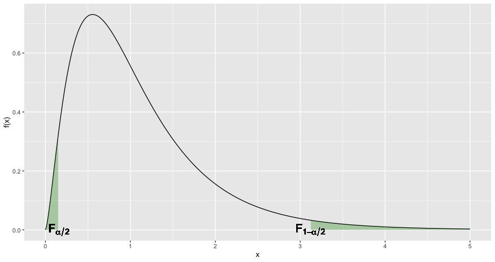

```{r setup, include=FALSE}
knitr::opts_chunk$set(echo = TRUE)
```

# Comparação de variâncias
## Comparação de variâncias

>- Quando fizemos inferência para a diferença de médias ($\mu_x - \mu_y$) com variâncias desconhecidas vimos que tinhamos 2 procedimentos diferentes: \begin{itemize}
\item Quando as variâncias são desconhecidas e iguais 
\item Quando as variâncias são desconhecidas e diferentes
\end{itemize}

>- Mas se as variâncias são desconhecidas, como podemos saber se são iguais ou diferentes?
>- Para responder essa pergunta precisamos fazer um teste para comparar as variâncias desconhecidas.


## Comparação de variâncias

Para testar a igualdade de variâncias, precisamos primeiro conhecer a distribuição F (que será a distribuição que terá nossa estatística de teste).

\pause

### A Distribuição F

>- A distribuição F tem 2 parêmetros: $m$ (graus de liberdade do numerador) e $n$ (graus de liberdade do denominador).
>- Se $X\sim N(0,1)$, então $X^2 \sim \chi^2_1$
>- Se $X_1, X_2, \ldots, X_n \sim \chi^2_1$, então $X_1 + \cdots + X_n \sim \chi^2_n$
>- Seja $X \sim \chi^2_{m}$ e $Y \sim \chi^2_{n}$, então $$F = \dfrac{X/m}{Y/n} \sim F_{m, n}$$

## Comparação de variâncias

### A Distribuição F


```{r fig.height=6, fig.width=12, message=FALSE, warning=FALSE, echo = FALSE}
x <- seq(0,8, by = 0.01)
n <- length(x)
y1 <- df(x,3.7,8)
y2 <- df(x,10,3)
y3 <- df(x, 2.3,15.3)
y4 <- df(x,20,41.3)
dados <- data.frame(X = rep(x,4), Y = c(y1,y2,y3,y4), 
                    Nome = c(rep("m = 3.7, n = 8", n),
                             rep("m = 10, n = 3", n),
                             rep("m = 2.3, n = 15.3", n),
                             rep("m = 20, n = 41.3", n)))
library(ggplot2)
ggplot(dados) + geom_line(aes(X,Y, color=Nome)) + theme(legend.title = element_blank())
```

## Comparação de variâncias

### Teorema

Sejam $X_1 \ldots, X_{n_x} \sim N(\mu_x, \sigma_x)$ e sejam $Y_1 \ldots, Y_{n_y} \sim N(\mu_y, \sigma_y)$. Então $$F = \dfrac{\hat{\sigma}_x^2/\sigma_x^2}{\hat{\sigma}_y^2/\sigma_y^2} \sim F_{n_x-1,n_y-1},$$ em que $\hat{\sigma}_x^2$ e $\hat{\sigma_y^2}$ são a variâncias amostral de $X_1 \ldots, X_{n_x}$ e $Y_1 \ldots, Y_{n_y}$, respectivamente.


## Comparação de variâncias

$$F = \dfrac{\hat{\sigma}_x^2/\sigma_x^2}{\hat{\sigma}_y^2/\sigma_y^2} \sim F_{n_x-1,n_y-1}$$


\pause

Utilizaremos a estatística F para testar:

>- $H_0: \sigma_x^2 = \sigma_y^2 \quad vs \quad H_1: \sigma_x^2 \neq \sigma_y^2$
>- $H_0: \sigma_x^2 \leq \sigma_y^2 \quad vs \quad H_1: \sigma_x^2 > \sigma_y^2$ 
>- $H_0: \sigma_x^2 \geq \sigma_y^2 \quad vs \quad H_1: \sigma_x^2 < \sigma_y^2$ 

\pause

>- Mas como utilizaremos $F$ para fazer os testes de não conhecemos as variâncias $\sigma_x^2$ nem $\sigma_y^2$?
>- Sob $H_0$ ($\sigma_x^2 = \sigma_y^2$) temos que: $$F = \dfrac{\hat{\sigma}_x^2}{\hat{\sigma}_y^2} \sim F_{n_x-1,n_y-1}$$


## Comparação de variâncias


```{r echo=FALSE, out.width = '100%'}

```

## Comparação de variâncias


Seja $$F = \hat{\sigma}_x^2/\hat{\sigma}_y^2$$

>- Se $H_0: \sigma_x^2 = \sigma_y^2 \quad vs \quad H_1: \sigma_x^2 \neq \sigma_y^2$, rejeitamos $H_0$ se $F > F_{1-\alpha/2,n_x-1,n_y-1}$ ou se $F < F_{\alpha/2,n_x-1,n_y-1}$
>- Se $H_0: \sigma_x^2 \leq \sigma_y^2 \quad vs \quad H_1: \sigma_x^2 > \sigma_y^2$, rejeitamos $H_0$ se $F > F_{1-\alpha,n_x-1,n_y-1}$
>- Se $H_0: \sigma_x^2 \geq \sigma_y^2 \quad vs \quad H_1: \sigma_x^2 < \sigma_y^2$, rejeitamos $H_0$ se $F < F_{\alpha,n_x-1,n_y-1}$

## Comparação de variâncias

**Ejemplo:** Considere o seguinte teste $H_0: \mu_x = \mu_y \quad vs. \quad H_1: \mu_x \neq \mu_y$. Duas amostras aleatórias de provenientes de uma $N(\mu_x, \sigma_x)$ e $n(\mu_y, \sigma_y)$ produziram os seguintes resultados:

- **Amostra 1:** $n_x = 5$, $\bar{x} = 25.36$,  $\hat{\sigma}_x =  2.1$
- **Amostra 2:** $n_y = 10$, $\bar{y} = 15.64$,  $\hat{\sigma}_y =  4.1$

Rejeitamos ou não rejeitamos $H_0$? 

\pause

**Solução**

>- Nível de significância $\alpha = 0.05$
>- Definimos nossa estatística de teste: \begin{itemize}
\item Mas para saber qual estatística de teste utilizar precisamos saber se as variâncias são iguais ou diferentes!
\item Precisamos então fazer um teste de hipóteses para saber se as variâncias são iguais ou diferentes
\end{itemize}

## Comparação de variâncias

$$H_0: \sigma^2_x = \sigma_y^2 \quad vs. \quad H_1: \sigma^2_x \neq \sigma_y^2$$

>- Nível de significância $\alpha = 0.05$
>- Definimos a estatística de teste: $$F = \hat{\sigma}_x^2/\hat{\sigma}_y^2 = 2.1^2 / 4.1^2 = 0.2623438$$
>- Como $H_0: \sigma^2_x = \sigma_y^2 \quad vs. \quad H_1: \sigma^2_x \neq \sigma_y^2$, rejeitamos $H_0$ se $F > F_{1-\alpha/2, n_x-1, n_y-1}$ ou $F < F_{\alpha/2, n_x-1, n_y-1}$

\pause

```{r}
alpha = 0.05; nx = 5; ny = 10
c(qf(1-alpha/2, nx-1, ny-1), qf(alpha/2, nx-1, ny-1))
```

\pause

>- 0.26 < 0.1123005 ou 0.26 > 4.7180785 **?** Não, então não rejeitamos $H_0$ e concluimos que não temos evidência para dizer que as variâncias são diferentes.


## Comparação de variâncias

Com os resultados do teste de igualdade de variância, escolheremos a estatística de teste apropriada para testar $$H_0: \mu_x = \mu_y \quad vs. \quad H_1: \mu_x \neq \mu_y$$

>- Definindo estatística de teste (caso variâncias desconhecidas e iguais): $$t = \dfrac{(\bar{x}- \bar{y}) - D_0}{s_p \sqrt{\dfrac{1}{n_1} + \dfrac{1}{n_2}}} = \dfrac{25.36-15.64}{\sqrt{12.17615} \sqrt{\dfrac{1}{5} + \dfrac{1}{10}}} = 5.085699$$ em que  $s_p^2 = \dfrac{(n_1-1)\hat{\sigma}_x^2 + (n_2 -1)\hat{\sigma}_y^2}{n_1 + n_2-2} = 12.17615$.


## Comparação de variâncias

$$H_0: \mu_x = \mu_y \quad vs. \quad H_1: \mu_x \neq \mu_y$$

>- $t = 5.085699$
>- Como $H_0: \mu_x = \mu_y \quad vs. \quad H_1: \mu_x \neq \mu_y$, rejeitamos $H_0$ se $|t| > t_{1-\alpha/2,n_1+n_2-2}$

\pause
```{r}
alpha = 0.05; n1 = 5; n2 = 10
qt(1-alpha/2, n1 + n2 -2)
```

\pause

>- |5.085699| > 2.160369 **?** Sim, então rejeitamos $H_0$ e concluimos que $\mu_x \neq \mu_y$.


# Análise de variância
## Análise de variância

>- Até agora temos visto testes de hipóteses para comparar duas médias populacionais.
>- Em algumas circunstâncias podemos estar interessados em testar se a média populacional de três ou mais populações são iguais.
>- Para responder esta pergunta, utilizaremos um procedimento conhecido como **análise de variància** (ou **ANOVA**).


## Análise de variância

**Case:** Um teste de habilidades é aplicado em uma amostra de 100 trabalhadores de cada um dos três centros de distribuição (CD) da _Via Varejo_. Roberto Fulcherberguer, o CEO da empresa, gostaria de saber se em média, os três centros de distribuição possuem funcionários com o mesmo nível de habilidades. Os resultados obtidos nas amostras foram:

- CD1: $\bar{x}_1 = 79$, $\hat{\sigma}_1 = 5.83$
- CD2: $\bar{x}_2 = 74$, $\hat{\sigma}_2 = 4.47$
- CD3: $\bar{x}_3 = 66$, $\hat{\sigma}_3 = 5.66$


\pause

Se denotarmos por $\mu_1, \mu_2, \mu_3$ as médias populacionais correspondentes às puntuações dos 3 CDs. O CEO quer testar: $$H_0: \mu_1 = \mu_2 = \mu_3 \quad vs. \quad H_1: H_0 \text{ não é verdade}$$

## Análise de variância


Para testar $$H_0: \mu_1 = \mu_2 = \mu_3 \quad vs. \quad H_1: H_0 \text{ não é verdade}$$

nenhum dos testes vistos até agora são úteis.


\pause


Utilizaremos ANOVA (análise de variância) para responder esta pergunta:

\pause

#### Hipóteses ANOVA:

>- **Independência:** entre as observações (Exemplo: a pontuação que cada trabalhador obteve é independente da obtida por outro funcionário)
>- **Normalidade:** a variável de interesse de cada grupo é normalmente distribuida.
>- **Igualdade de variâncias:** os grupos tem a mesma variância (variâncias desconhecidas mas iguais)


## Análise de variância

#### Intuição

>- Se as três médias populacionais fossem iguais, esperamos que as três médias amostrais  estejam próximas entre si.
>- Quanto mais próximas estejam as médias amostrais entre si, teremos mais evidência para concluir que as médias populacionais são iguais.
>- Por outro lado, quando mais diferirem as médias amostrais entre si, teremos mais evidência para dizer que as médias populacionais não são iguais.
>- Em outras palavras, se a variabilidade entre entre as médias amostrais for pequena, teremos evidência favoravel (não rejeitar) a $H_0: \mu_1 = \mu_2 = \mu_3$, enquanto que se a variabilidade entre as médias amostrais for grande, teremos evidència contraria (rejeitar) a $H_0$.
>- Ademais, se $H_0$ for verdadeira implica que todas as amostras vem de uma mesma $N(\mu, \sigma)$


## Análise de variância

#### Intuição

>- Voltando ao exemplo, se $H_0$ for verdade, então podemos pensar em $\bar{x}_1$, $\bar{x}_2$ e $\bar{x}_3$ como três números extraidos de uma $N(\mu, \sigma_{\bar{x}})$.
>- Então podemos estimar $\mu$ por $$\bar{x} = \dfrac{\bar{x}_1 + \bar{x}_2 + \bar{x}_3}{3}$$ e podemos estimar $\sigma_{\bar{x}}^2$  por $$\hat{\sigma}^2_{\bar{x}} = \dfrac{(\bar{x}_1 - \bar{x})^2 + (\bar{x}_2 - \bar{x})^2 + (\bar{x}_3 - \bar{x})^2}{3-1}.$$ Como $\sigma_{\bar{x}}^2 = \sigma^2/n$, temos que $\hat{\sigma}^2 = n \hat{\sigma}^2_{\bar{x}}$.

## Análise de variância

#### Intuição

>- Então temos $\hat{\sigma}^2$ uma estimativa  não viesada de $\sigma^2$
>- Por outro lado, $\hat{\sigma}^2_1$, $\hat{\sigma}^2_2$ e $\hat{\sigma}^2_3$ são também estimativas não viesadas de $\sigma^2$ 
>- Note que $\dfrac{\hat{\sigma}^2_1 + \hat{\sigma}^2_2 + \hat{\sigma}^2_3}{3}$ também é uma estimativa não viesada de $\sigma^2$
>- Se $H_0$ for verdadeira tanto $\hat{\sigma}^2$ quanto $(\hat{\sigma}^2_1 + \hat{\sigma}^2_2 + \hat{\sigma}^2_3)/3$ serão ambas próximas entre si.
>- Isso significa que o quociente entre eles deve ser próximo de um.

\pause


\color{violet}
ANOVA baseia-se em duas estimativas independêntes da variância comum $\sigma^2$. Uma delas, $\hat{\sigma}^2$ baseia-se na variabilidade existente entre as próprias médias amostrais (chamada variância entre tratamentos). A outra, baseia-se na variabilidade dos dados existente dentro de cada grupo (chamada variância dentro dos tratamentos). Comparando essas duas estimativas seremos capazes de testar se as médias populacionais são iguais ou não.
\color{black}

## Análise de variância (ANOVA)

Sejam as hipóteses: \color{violet} $$H_0: \mu_1 = \mu_2 = \ldots = \mu_k. \quad vs. \quad H_1: H_0 \text{ não é verdade},$$ \color{black} em que $\mu_j$ ($j = 1, \ldots, k$) é a média da $j$-ésima população.

\pause

Sejam:

- $n_j$: tamanho da a.a. extraida da $j$-ésima população;
- $x_{ij}$: $i$-ésimo elemento da a.a extraida da $j$-ésima população;
- $\bar{x}_j$: média amostral da a.a. da  $j$-ésima população;
- $\hat{\sigma}_j^2$: variância amostral da a.a. da $j$-ésima população.

\pause

Por outro lado, denotemos por $\bar{\bar{x}}$ a média global de todas as observações, $$\bar{\bar{x}} = \dfrac{ \sum_{j=1}^k \sum_{i=1}^{n_j} x_{ij}}{n_T},$$ em que $n_T = n_1 + n_2 + \cdots + n_k$

## Análise de variância (ANOVA)

$$SQT = SQTr+ SQE$$

\pause

>- **Soma de Quadrados Totais** $$SQT = \displaystyle \sum_{j=1}^{k} \sum_{i}^{n_j} (x_{ij} - \bar{\bar{x}})^2$$
>- **Soma de Quadrados entre tratamentos** $$SQTr = \displaystyle \sum_{j=1}^{k} \sum_{i}^{n_j} (\bar{x}_{j} - \bar{\bar{x}})^2 = \sum_{j=1}^{k} n_j (\bar{x}_{j} - \bar{\bar{x}})^2$$
>- **Soma de Quadrados dos Erros (ou dentro dos tratamentos)** $$SQE = \displaystyle \sum_{j=1}^{k} \sum_{i}^{n_j} (x_{ij} - \bar{x}_j)^2$$


## Análise de variância (ANOVA)


| Fonte de Variação | g.l  |  Soma dos Q.  | Q. Médios | F     |
|:-----------------|:----|:--------------------:|:-----------------:|:----:|
| Tratamento        |  $k-1$ |  SQTr                | $QMTr = \dfrac{SQTr}{k-1}$ | $\dfrac{QMTr}{QME}$ |
| Erro              | $n_T - k$ |  SQE              | $QME = \dfrac{SQE}{n_T - k}$ |        |
| Total             | $n_T-1$   | SQT               |                       |        |

\pause

Pode-se provar que, sob $H_0$ e sob as hipóteses do ANOVA: $$F = \dfrac{QMTr}{QME} \sim F_{k-1, n_T-k}$$

\pause

Assim, \color{violet} rejeitamos $H_0: \mu_1 = \mu_2 = \cdots = \mu_k$ se $F > F_{1-\alpha, k-1, n_T-k}$ \color{black}


## Análise de variância (ANOVA)


Note que se $n_j = n \quad \forall j$:


>- $SQTr = \sum_{j=1}^{k} n_j (\bar{x}_{j} - \bar{\bar{x}})^2 = n \sum_{j=1}^{k} (\bar{x}_{j} - \bar{\bar{x}})^2,$ e então $QMTr = \dfrac{SQTr}{k-1} = n \dfrac{\displaystyle \sum_{j=1}^{k} (\bar{x}_{j} - \bar{\bar{x}})^2}{k-1}$ é o nosso $\hat{\sigma}^2$ obtido no _case_.
>- De forma semelhante, $MQE = \dfrac{\displaystyle \sum_{j = 1}^k \sum_{i=1}^{n_j}(x_{ij} - \bar{x}_j)^2}{n_T-k}$, mas como $n_j = n$ e $n_T = n_1 + \cdots + n_k = kn$ temos que, $$QME = \dfrac{\displaystyle \sum_{j = 1}^k \overbrace{\sum_{i=1}^n (x_{ij} - \bar{x}_j)^2}^{(n-1)\hat{\sigma}_j^2}}{k(n-1)} = \dfrac{\displaystyle \sum_{i}^k \hat{\sigma}^2_j}{k}.$$ 


## Análise de variância (ANOVA)

Voltando ao nosso _case_. O CEO da _Via Varejo_ quer testar: $$H_0: \mu_1 = \mu_2 = \mu_3 \quad vs. \quad H_1: H_0 \text{ não é verdade}$$

\pause

- **Amostra do CD1**: $\bar{x}_1 = 79$, $\hat{\sigma}_1 = 5.83$, $n_1 = 100$
- **Amostra do CD2**: $\bar{x}_2 = 74$, $\hat{\sigma}_2 = 4.47$, $n_2 = 100$
- **AMostra do CD3**: $\bar{x}_3 = 66$, $\hat{\sigma}_3 = 5.66$, $n_3 = 100$

\pause

| Fonte de Variação | g.l  |  Soma dos Q.  | Q. Médios | F     |
|:-----------------|:----|:--------------------:|:-----------------:|:----:|
| Tratamento        |  $k-1$ |  SQTr                | $QMTr = \dfrac{SQTr}{k-1}$ | \color{red} $\dfrac{QMTr}{QME}$ \color{black}|
| Erro              | $n_T - k$ |  SQE              | $QME = \dfrac{SQE}{n_T - k}$ |        |
| Total             | $n_T-1$   | SQT               |                       |        |

## Análise de variância (ANOVA)

- **Amostra do CD1**: $\bar{x}_1 = 79$, $\hat{\sigma}_1 = 5.83$, $n_1 = 100$
- **Amostra do CD2**: $\bar{x}_2 = 74$, $\hat{\sigma}_2 = 4.47$, $n_2 = 100$
- **AMostra do CD3**: $\bar{x}_3 = 66$, $\hat{\sigma}_3 = 5.66$, $n_3 = 100$

\pause

Como $k = 3$ grupos e $n_j = n \quad j=1, \ldots, 3$:

>- $\bar{\bar{x}} = \dfrac{79+74+66}{3}=73$
>- $QMTr = n \dfrac{ \sum_{j=1}^{3} (\bar{x}_{j} - \bar{\bar{x}})^2}{3-1} = 100 \times  \dfrac{(79-73)^2+(74-73)^2+(66-73)^2}{2} = 4300$
>- $QME =  \dfrac{ \sum_{i}^3 \hat{\sigma}^2_j}{3} = \dfrac{5.83^2+4.47^2+5.66^2}{3} = 28.66847$
>- $F = QMTr/QME = 4300/28.66847 = 149.9906$


## Análise de variância (ANOVA)


>- F = 149.9906

\pause
```{r}
k = 3; n = 100; alpha = 0.05
qf(1-alpha, k-1, 3*n-k)
```

\pause

149.9906> 3.026153**?** Sim, então rejeitamos $H_0$.

## Análise de variância (ANOVA)

**Exemplo:** Quatro observações foram selecionadas de cada uma de três diferentes populações. Os dados obtidos são os seguintes:

| Observação | Amostra 1 | Amostra 2 | Amostra 3   |
|:----------:|:---------:|:---------:|:-----------:|
| 1 | 165 | 174 | 169 |
| 2 | 149 | 164 | 154 |
| 3 | 156 | 180 | 161 |
| 4 | 142 | 158 | 148 |

Teste $$H_0: \mu_1 = \mu_2 = \mu_3 \quad vs. \quad H_1: H_0 \text{ não é verdadeira}$$


## Análise de variância (ANOVA)

```{r}
x1 = c(165, 149, 156, 142)  # amostra 1
x2 = c(174, 164, 180, 158)  # amostra 2
x3 = c(169, 154, 161, 148)  # amostra 3
x = c(x1,x2,x3)             # todos os elementos
# Calculamos as médias:
m_g = mean(x)               # média global
m_1 = mean(x1)              # média da amostra 1
m_2 = mean(x2)              # média da amostra 2
m_3 = mean(x3)              # média da amostra 3
# Tamanhos de amostra em cada grupo
n1 = length(x1)             # Obs na amostra 1
n2 = length(x2)             # Obs na amostra 2
n3 = length(x3)             # Obs na amostra 3
```

## Análise de variância (ANOVA)

$$SQT = SQTr + SQE$$

$SQT = \displaystyle \sum_{j=1}^{k} \sum_{i}^{n_j} (x_{ij} - \bar{\bar{x}})^2 \quad SQTr = \displaystyle \sum_{j=1}^{k} n_j (\bar{x}_{j} - \bar{\bar{x}})^2$

\pause


```{r}
# Soma de Quadrados Totais
SQT = sum((x-m_g)^2)    # Cuidado! sum((x-m_g)^2) != sum(x-mg)^2 
# Soma de Quadrados dos Tratamentos
SQTr = n1*(m_1-m_g)^2 + n2*(m_2-m_g)^2 + n3*(m_3-m_g)^2
# Soma de Quadrados dos Erros
SQE = SQT -  SQTr
# Imprimindo resultados
c(SQT, SQTr, SQE)
```


## Análise de variância (ANOVA)


| Fonte de Variação | g.l  |  Soma dos Q.  | Q. Médios | F     |
|:-----------------|:----|:--------------------:|:-----------------:|:----:|
| Tratamento        |  $k-1$ |  SQTr                | $QMTr = \dfrac{SQTr}{k-1}$ | \color{red} $\dfrac{QMTr}{QME}$ \color{black}|
| Erro              | $n_T - k$ |  SQE              | $QME = \dfrac{SQE}{n_T - k}$ |        |
| Total             | $n_T-1$   | SQT               |                       |        |

\pause

| Fonte de Variação | g.l  |  Soma dos Q.  | Q. Médios | F     |
|:-----------------|:----|:--------------------:|:-----------------:|:----:|
| Tratamento        |  2 |  `r SQTr`               | $QMTr =$ `r SQTr/2`  | `r (SQTr/2)/(SQE/9)` |
| Erro              | 9 |  `r SQE`             | $QME =$ `r SQE/9` |        |
| Total             | 11  | `r SQT`              |                       |        |

## Análise de variância (ANOVA)


Então rejeitamos $H_0: \mu_1 = \mu_2 = \mu_3$ se $F>F_{1-\alpha, k-1, n_T-k}$

\pause

```{r}
alpha = 0.05; k = 3; nT = n1 + n2 + n3
qf(1-alpha, k-1, nT-k)
```

\pause

`r (SQTr/2)/(SQE/9)` > `r round(qf(1-alpha, k-1, nT-k),6)`**?** Não, então não rejeitamos $H_0$.


## Análise de variância (ANOVA)

No **R** existe uma forma fácil de fazer ANOVA.

Os dados do exemplo anterior estão disponíveis \color{blue}[aqui](https://raw.githubusercontent.com/ctruciosm/ctruciosm.github.io/master/datasets/anova_dados.csv). \color{black}

\pause

```{r}
dados <- read.csv("anova_dados.csv", sep = ";")
oneway.test(V1 ~ grupo, data = dados, var.equal = TRUE)
```

Como p-valor não é menor do que $\alpha = 0.05$, não rejeitamos $H_0$

## Leituras recomendadas

- Anderson, D. R; Sweeney, D. J.; e Williams, T. A. (2008). *Estatística Aplicada à Administração e Economia*. 2ed. Cengage Learning. **Cap 10**
- Morettin, P.A;  e Bussab, W. de O. (2004). *Estatística Básica*. 5ed, Saraiva. **Cap 13**


